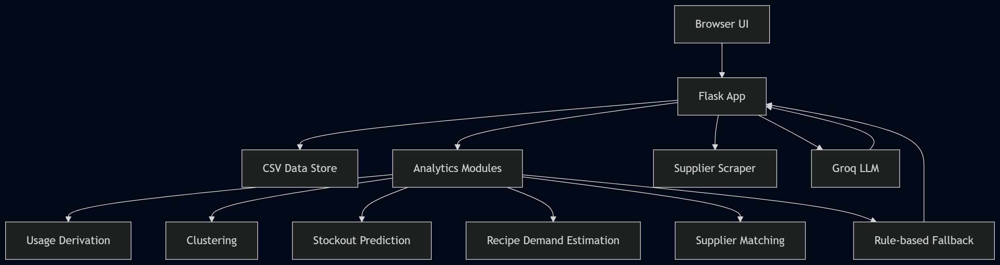

# Design Document

## 1. Overview

CafeTrack Inventory Assistant is a lightweight inventory intelligence system for a small cafe operation. It combines deterministic analytics with optional LLM-generated summaries to help operators answer three core questions:

- Which items need immediate action?
- When will stock run out?
- Which supplier is the best fit for a reorder?

The application is intentionally simple to run locally: a Flask web application backed by CSV files, pandas-based transformations, scikit-learn models for clustering and forecasting support, and a Groq-powered summarization layer when credentials are available.

## 2. Goals

- Provide a clear daily dashboard for stock health.
- Detect reorder and expiry risks from real inventory data.
- Reconcile stock movement with order-derived usage to surface anomalies.
- Generate actionable insights even when AI services are unavailable.
- Keep setup and local execution simple for an assessment-scale solution.

## 3. Non-Goals

- Multi-user production-grade concurrency.
- Enterprise authentication and authorization.
- Real-time supplier API integrations.
- Highly accurate long-horizon demand forecasting.
- Full database-backed audit and workflow orchestration.

## 4. Solution Outline

The system is organized as a thin Flask application layer over a set of focused analytics modules.

### 4.1 User-facing flows

1. Dashboard:
   Shows all inventory items, stock level, expiry horizon, cluster-based status, and approximate stockout timing.

2. Event logging:
   Users log stock events such as received shipments or remaining physical counts. These writes update CSV data and immediately refresh inventory state.

3. Recipe and order workflow:
   Recipe definitions and order history are used to estimate expected ingredient consumption and reduce inventory when orders are logged.

4. Insights:
   For a selected item, the system runs the analytics pipeline, compares stock-derived and order-derived usage, predicts stockout, suggests suppliers, and optionally asks the LLM to summarize findings.

### 4.2 High-level architecture

### 4.3 Architectural decisions

- Flask is used as the orchestration layer because the solution is route-driven, server-rendered, and simple.
- CSV files are the source for data and as storage of new logs.
- Analytics logic is isolated into dedicated modules so the web layer stays thin and behavior remains testable.
- The LLM is used as a summarizer, not as the source of predictions. This prevents hallucinations and involves a resource-friendly and cost-friendly approach to a simple problem.
- Rule-based fallback ensures the insights screen still works when the API key, network, or quota is unavailable.

## 5. Component Design

### 5.1 Application layer

The main app is responsible for:

- Flask route registration
- Template rendering
- request-time data refresh from disk
- Cache invalidation when CSV-backed data changes
- Orchestration of the end-to-end item insights pipeline

The route set supports:

- dashboard view
- stock event entry
- recipe view
- order logging
- recent log review
- portfolio insights view
- single-item insights view

### 5.2 Data layer

The app stores operational data in CSV files under `src/data`:

- `inventory.csv`
- `stock_events.csv`
- `order_history.csv`
- `recipes.csv`
- `recipe_ingredients.csv`

To reduce inconsistency risk, writes are persisted atomically and runtime caches are invalidated after mutations.

### 5.3 Analytics layer

The analytics layer is composed of focused modules:

- `usage_calculator.py`
  Derives actual usage from stock events, derives theoretical usage from order history, and reconciles the two.

- `predictor.py`
  Smooths usage history and uses linear regression on cumulative consumption to estimate days until stockout.

- `clusterer.py`
  Builds feature vectors and runs K-Means clustering on inventory behavior to classify items such as Reorder Now, Expiry Risk, High Velocity, or Stable.

- `recipe_estimator.py`
  Estimates ingredient demand from recipe sales and identifies bottleneck ingredients.

- `procurement.py`
  Scores supplier options using sustainability, preference alignment, and lead time suitability.

- `fallback.py`
  Produces deterministic alerts and narrative summaries when AI is skipped or unavailable.

- `agent.py`
  Builds a retrieval-augmented prompt from structured outputs and requests a Groq LLM summary.

### 5.4 Supplier ingestion

The scraper currently reads static HTML pages from `src/scraper/mock_pages`. This supports a realistic procurement demo without requiring live web scraping or vendor APIs. Parsed supplier data is flattened into a consistent structure for downstream recommendation logic.

### 5.5 Presentation layer

The frontend is implemented with Jinja templates and a shared stylesheet. It emphasizes fast delivery of operational information rather than a complex client-side architecture.

Primary screens:

- dashboard summary and filtering
- stock event logging
- recipe overview
- recent logs
- deep item insights with reconciliation, AI summary, and supplier recommendations

## 6. Data Flow

### 6.1 Dashboard flow

1. Request enters Flask.
2. App refreshes in-memory DataFrames if underlying CSV files changed.
3. Inventory features are built from inventory and stock event data.
4. Clustering classifies each item.
5. The rendered dashboard shows stock, expiry, cluster label, and approximate stockout urgency.

### 6.2 Item insights flow

1. Load the selected item from inventory.
2. Derive stock-based usage from physical stock events.
3. Derive order-based usage from recipes and sales history.
4. Reconcile both series to detect discrepancy.
5. Predict stockout from both series and compare confidence.
6. Estimate recipe-driven ingredient demand.
7. Score and rank suppliers.
8. If enough data and AI budget are available, generate an LLM summary from structured context.
9. Otherwise, return a rule-based fallback summary.
10. Render a combined insights page.

## 7. Tech Stack

### 7.1 Backend

- Python 3.11+
- Flask for the web application and route handling
- Jinja2 for server-side HTML rendering
- python-dotenv for environment configuration
- markdown2 for rendering markdown-based AI output

### 7.2 Data and analytics

- pandas for tabular data loading and transformation
- NumPy for numerical operations
- scikit-learn for K-Means clustering and linear regression
- SciPy and joblib as transitive scientific stack support

### 7.3 AI and integration

- Groq Python client for optional LLM-based inventory summaries
- httpx for configurable HTTP transport
- certifi and python-certifi-win32 for certificate handling on Windows and corporate networks

### 7.4 Scraping and parsing

- BeautifulSoup4 for parsing supplier HTML mock pages

### 7.5 Quality and testing

- pytest for unit and integration tests

## 8. Reliability and Safety Design

- Classical analytics remain the source of truth; the LLM only summarizes computed facts.
- AI failures degrade gracefully to deterministic rule-based output.
- Atomic CSV writes reduce the risk of partial file corruption.
- Request-time refresh keeps the UI synchronized with persisted state.
- Caching reduces repeated heavy recomputation while still being invalidated on data changes.

## 9. Future Enhancements

### 9.1 Data and platform

- Replace CSV storage with PostgreSQL or SQLite plus migrations.
- Add a repository or service layer to separate persistence concerns from route logic.
- Introduce background jobs for scheduled forecasting, alert generation, and supplier refresh.
- Add structured logging, metrics, and tracing for operational visibility.

### 9.2 Analytics

- Add seasonality-aware demand forecasting.
- Calibrate cluster thresholds with historical reorder outcomes.
- Track forecast accuracy over time.
- Add anomaly classification to distinguish waste, theft, spoilage, and counting errors.

### 9.3 Product features

- Add role-based access and authentication.
- Add reorder workflows with approval status and purchase history.
- Add configurable supplier preferences by cafe or user.
- Add low-stock notifications via email or chat integrations.
- Add end-to-end audit trails for stock adjustments.

### 9.4 Frontend and UX

- Improve accessibility and responsive behavior.
- Add trend charts for usage and predicted depletion.
- Add inline explanations for confidence scoring and model limitations.
- Add bulk actions for event entry and procurement review.

### 9.5 Integration

- Replace static supplier scraping with real supplier APIs.
- Add POS integration for automatic order ingestion.
- Add ERP or procurement export formats.
- Support deployment to a managed cloud runtime with environment-specific configuration.

## 10. Summary

This solution is designed as a pragmatic inventory intelligence prototype: easy to run, easy to inspect, and structured so that deterministic analytics remain trustworthy while AI adds only optional interpretive value. The current architecture is appropriate for a local demo or small pilot and provides a clear path toward a more production-ready platform.